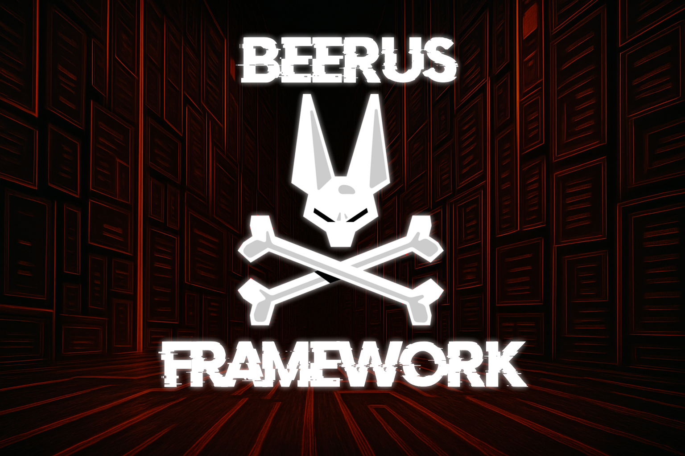

<h1 align="center">Beerus Framework</h1>

<p align="center">
  <a href="#" rel="noopener">
    
  </a>
</p>

<div align="center">

[]()
[](https://github.com/hakaioffsec/beerus-ios/releases)
[](https://github.com/hakaioffsec/beerus-ios/issues)
[](https://github.com/hakaioffsec/beerus-ios/pulls)
[](https://github.com/hakaioffsec/beerus-ios/blob/main/LICENSE)

</div>

---

<p align="center">
  <strong>Beerus Framework</strong> is a project developed by the <strong>Hakai Offensive Security Research Team</strong> to assist you throughout the mobile penetration testing process.<br>
  It provides powerful utilities, from sandbox exfiltration PoCs to fully managing and instrumenting applications directly on your device, without needing a computer.
</p>

## 📝 Table of Contents

- [About](#about)
- [Build](#build)
- [Authors](#authors)
- [References](#acknowledgement)

## 🧐 About <a name="about"></a>

Beerus Framework is a powerful and modular toolkit designed to support every stage of the mobile penetration testing lifecycle. It empowers pentesters with flexibility and efficiency, offering a rich set of features such as:

- **Frida Server Setup** - Simplifies the setup and management of Frida Server.
- **Script Editor + Frida Auto Inject** - Built-in Frida script editing and instrumentation directly on the device.
- **IPA Extractor** - Extracts and decrypts installed iOS applications into IPA files.
- **Memory Dump** - Captures application memory for runtime data and secret analysis.
- **LLDB Server** - Enables remote application debugging through LLDB.
- **Proxy Profiles** - Simplifies proxy configuration for intercepting application traffic.
- **Terminal** - Provides an on-device terminal with privileged command execution.
- **Plist Reader** - Reads and analyzes application Property List (Plist) files.
- **APP Store** - Installs compatible applications and previous versions directly from the App Store.
- **JB Bypass** - Helps bypass jailbreak detection mechanisms during security testing.
- **Sandbox Exfiltration** - Extracts application sandbox files and data for offline security analysis.

Learn more in our [Blog Post](https://yokai.hakaisecurity.io/enbeerus-framework-ios-the-swiss-army-knife-for-ios/).

## 🛠️ Build and Install <a name="build"></a>

1. Connect your iOS device on Mac
2. Run the command below:

#### For Rootfull
```bash
./init build
```

#### For Rootless
```bash
./init build --rootless
```

3. Copy the file to the iOS device using scp
4. ​​Install it using dpkg

## 📦 Downloads

The official Beerus Framework builds are available exclusively on [GitHub](https://github.com/hakaioffsec/beerus-ios/releases/tag/Release).

Click below to download the latest Beerus APK:

[](https://github.com/hakaioffsec/beerus-ios/releases/tag/v1.0)

## ✍️ Authors <a name="authors"></a>

- [@Texugo](https://github.com/Texuguinho1234)
- [@ddaniboy](https://github.com/ddaniboy)
- [@kelvinmontini](https://github.com/kelvinmontini)


## 🎉 References <a name="acknowledgement"></a>

- [Frida](https://github.com/frida/frida) – Dynamic instrumentation toolkit for developers, reverse engineers, and security researchers.
- [Frida Swift](https://github.com/frida/frida-swift) – Lets you control Frida directly from an app written in Swift.
- [Palera1n](https://palera.in/) - Jailbreak for iPhone, iPad, Macbooks, and AppleTV's for versions 15 and higher